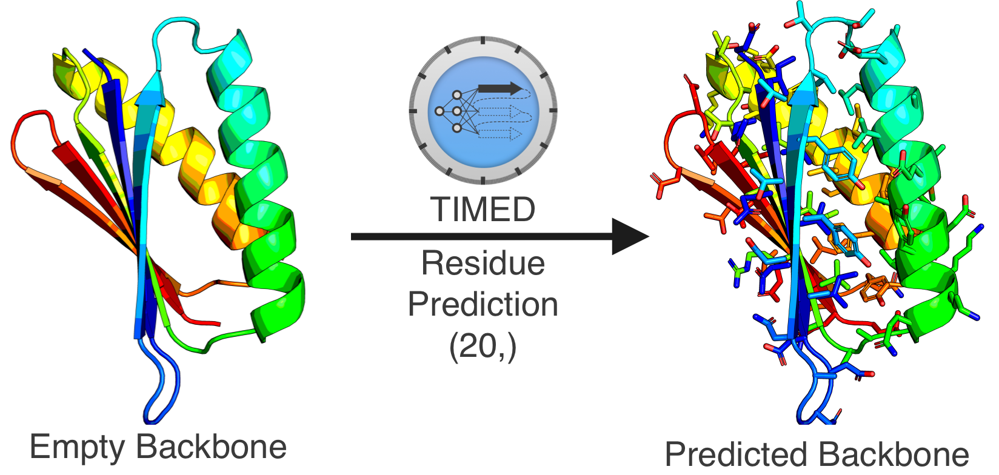
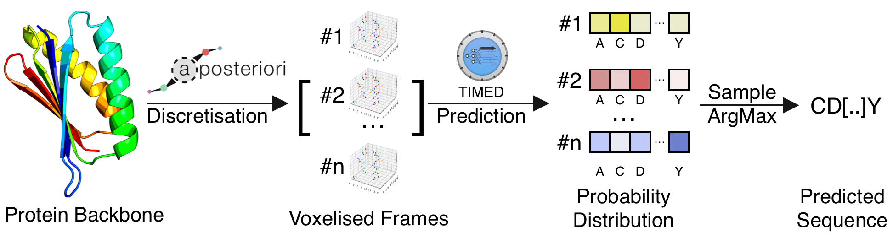
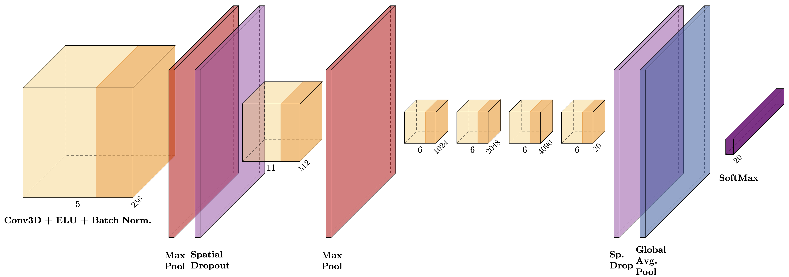
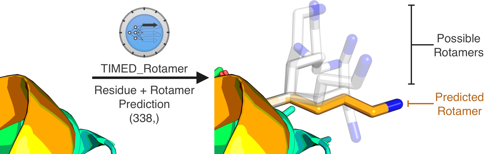

<div align="center">
  <br>
  <h2>Protein Sequence Design Made Easy</h2><br>
<a href="https://zenodo.org/badge/latestdoi/427622709"></a>

  


</div>

[timed-design](https://github.com/wells-wood-research/timed-design) is a library to use protein sequence design models and analyse predictions. We feature retrained Keras models for novel models (**TIMED** and **TIMED-rotamer**) as well as re-implementations of well known models for which code or model are not intuitively available (**ProDCoNN**, **DenseCPD**, **DenseNet**).

## Table of Contents:
- [Install](#install)
- [1. Use Models](#1-use-models)
- [2. Sample Sequences Using Monte Carlo](#2-sample-sequences-using-monte-carlo)
- [3. Analyse Rotamer Predictions](#3-analyse-rotamer-predictions)
- [4. Cite This Work](#4-cite-this-work)

## Install

0. Clone and move inside the TIMED-Design directory:

```
git clone https://github.com/wells-wood-research/timed-design.git
cd timed-design
```

1. Setting up conda:

```
conda create --name timed_design python=3.8
```

```
conda activate timed_design
```


2. Install requirements for headless version (no UI):

```
pip install -r requirements.txt
```

3. Install everything (TIMED-Design and UI):

Install TIMED-Design with pip:

```
pip install .
```

4. For GPU support. Of course, NVIDIA drivers will never work out of the box. In our servers we found
this workaround to work:

```
conda install cudatoolkit cudnn cupti 
export PATH=/usr/local/cuda/bin:$PATH
pip install nvidia-cudnn-cu11==8.6.0.163
CUDNN_PATH=$(dirname $(python -c "import nvidia.cudnn;print(nvidia.cudnn.__file__)"))
export LD_LIBRARY_PATH=$LD_LIBRARY_PATH:$CONDA_PREFIX/lib/:$CUDNN_PATH/lib
python3 -c "import tensorflow as tf; print(tf.config.list_physical_devices('GPU'))"
```


## 1. Use Models

**File**: `predict.py`

**Description**:  

Use any model to predict a 3D structure. This requires a backbone in a .pdb structure. The side-chains of the residues will be automatically removed by [aposteriori](https://github.com/wells-wood-research/aposteriori), thus the prediction will be performed uniquely on the empty backbone. Your chosen model will attempt to predict which residues best fit the position and will return a `.fasta` file as well as a probability distribution in `.csv` format. 

### 1.2 Design a Sequence

1. Make a folder with all the pdb files you want to predict

2. Create the dataset using aposteriori (For more info about other options, please see https://github.com/wells-wood-research/aposteriori/)

```shell
make-frame-dataset $YOUR_PDB_FOLDER  -e $YOUR_PDB_EXTENSION --voxels-per-side 21 --frame-edge-length 21 -g True -p 6 -n dataset -v -r -cb True -ae $YOUR_CODEC  --compression_gzip True -o .  --voxelise_all_states True
```

`$YOUR_PDB_FOLDER` is a path to your folders containing PDB files. These need to be all with the same format (e.g. `.pdb`)

`$YOUR_PDB_EXTENSION` is the file extension of your PDB files in `$YOUR_PDB_FOLDER` 

 `$YOUR_CODEC` This will normally be `CNOCBCA` except for TIMED_Charge `CNOCBCAQ` and TIMED_Polar `CNOCBCAP`

For a sample dataset use:

```shell
make-frame-dataset tests/testing_files -e .pdb1.gz --name data --voxels-per-side 21 --frame-edge-length 21 -p 8  -vrz -cb True -ae CNOCBCA -g True
```


3. Download your model of interest from:

https://github.com/wells-wood-research/timed-design/releases

For example, download TIMED.h5 . Make sure to place it in this directory. 

4. Finally run: 


```
python3 predict.py --path_to_dataset $DATASET_PATH --path_to_model MODEL_PATH --path_to_output OUTPUT_DIRECTORY
```

eg.

```
python3 predict.py --path_to_dataset data.hdf5 --path_to_model TIMED.h5 --path_to_output .
```

### 1.3 Predicting Rotamers

In order to use a rotamer model, use the flag `--predict_rotamers True`:


```
python3 predict.py --path_to_dataset dataset.hdf5 --path_to_model timed_rot.h5 --predict_rotamers True
```

### 1.4 Run User Interface (UI)

To run the UI you must have `streamlit` installed. Then run:


```
streamlit run ui.py --  --path_to_models /models --path_to_pdb /pdb --path_to_data /data --workers 8
```

If you prefer to use Docker, you can use the Dockerfile provided.

```
docker build -t timed_design .
docker run -v /local/path/to/models/:/scratch/timed_dataset/models -v /local/path/to/biounit:/scratch/datasets/biounit -p 8501:8501 timed_design
```


### 1.5 Install repository with pip

Enter the directory if you are not:

```
cd timed-design 
```

Install with pip:

```
pip install .
```


## 2. Sample Sequences Using Monte Carlo

**File**: `sample.py`
**Description**:  

Uses Monte Carlo sampling to sample sequences from a  probability distribution. A temperature factor can be applied to affect the distributions. It will return a `.fasta` file and/or a `.json` file with the sequences and a `.csv` file with basic sequence metrics such as isoelectric point, molecular weight and charge. Further metrics can be calculated using NetSolP-1.0 (see `scripts/run_netsolp.sh`).

## 3. Analyse Rotamer Predictions

**File**: `analyse_rotamers.py`
**Description**:  

---Under construction---


## 4. Background

Proteins are macro-molecules present in all living organisms (and viruses). They are involved in important chemical reactions in metabolism, DNA replication and also have structural properties. 

The 3D shape of the protein defines its function. Proteins are made of twenty subunits called amino acids (or residues), all of which have different atomic structures and chemical properties. Different combinations of amino acids produce different 3D shapes.

The **Protein Folding Problem** aims at identifying the 3D shape of a protein based solely on the sequence of amino acid. This problem is being tackled by models like **AlphaFold2** by Google Deep Mind.

The other side of this problem is the **Inverse Folding Problem** (Protein Sequence Design), that is, given a desired 3D structure with a useful function, identify the residue sequence that will reliably fold into this structure. This problem is arguably harder, as multiple sequence of amino acids can fit the same 3D shape. 

Nature evolves by natural selection (depth first search), thus, the protein sequences sampled in nature account for a tiny fraction of all physically possible proteins. Even for a relatively small protein with around **200 amino acids**, there are around **10^260 possible sequences**, which is significantly more than that have been sampled in every cell of every organism since proteins arose. There are therefore many 3D shapes of proteins that are physically possible, potentially useful, which have not been explored by nature. Protein designers aim at unlocking the potential of this pool of unobserved proteins, known as the **dark matter of protein folding space**.

### Protein Sequence Design with Deep Learning

TIMED (Three-dimensional Inference Method for Efficient Design) is a Convolutional Neural Network (CNN) model to tackle the Inverse Folding Problem, developed by us. We also feature our implementation of models described in the literature but unavailable for public use. These models take a 3D shape (empty backbone) as input and predict the identity of the subunits at each position of the backbone, as shown below:

<div align="center">
  <br>
</div>


The input of the model is a cube of gridded, voxelised space (a "Frame") around each amino acid position of the backbone. The alpha Carbon is centered in the frame, and the frame is rotated so that the Alpha Carbon to Carbon bond lies along the x-axis. Each atom (C, N, O, alpha-C, beta-C) is one-hot-encoded in a different channel, thus producing a 4D array. The beta-Carbon position is hard-coded to the average position of all beta-Carbon in the protein 1QYS after the aforementioned rotations.

For a 100-amino-acid protein we therefore generate 100 frames of equal width, height and length and feed them to our models. To produce these frames we use a library we developed called [aposteriori](https://github.com/wells-wood-research/aposteriori). 

The output of our models is a probability distribution over all amino acids at each position. For instance, at each position the models output a probability over every residue being at that position. For a 100-amino-acid protein will have an output of shape (100, 20) as there are twenty amino acids:

<div align="center">
  <br>
</div>

#### TIMED Architecture

The TIMED architecture features a Convolutional Block composed of a 3D Convolution Operation, followed by ELU Activation and Batch Normalisation. We feature several convolution blocks which end with Spatial Dropout and a Global Average Pooling layer rather than a Dense layer. The output of the softmax layer is either 20 (for the 20 residues) or 338 (for rotamers). The architecture is illustrated below 

<div align="center">
  <br>
</div>


### Improving Protein Sequence Design Further with Rotamers

Amino acids are made of chemical bonds that can rotate in space, thus resulting in a different spacial configuration of the residue. These are called **Rotational Isomers (Rotamers)**, and longer residues like Lysine (K), tend to have more rotamers.

Rather than predicting 20 amino acid, we built models to predict both the amino acid AND the rotamer configuration in space. Therefore, for one frame our model identifies both, the amino acid identity and its predicted conformation in space: 

<div align="center">
  <br>
</div>

The rotamer models therefore predict 338 classes rather than 20. **Rotamer models** tend to significantly **outperform conventional models**, even with the **same network structure**, while also providing increased granularity of predictions which can then be further refined using molecular dynamics simulations.

We are the first in the field to validate rotamer models and provide them and various implementation of other models, free for use. 

### Monte Carlo Sampling

As the output of our models is a probability distribution, an alternative to picking the amino acid with the highest probability (argmax), is to sample from the probability distribution using methods like Monte Carlo. For one protein shape we can therefore generate several sequences that can then be screened for specific properties like charge, isoelectric point, solubility, and expressivity. 

We provide a simple CLI interface to generate several of these design which output to a `.fasta` file.

## 5. Cite This Work

```
@software{leonardo_v_castorina_2022_6997495,
  author       = {Leonardo V Castorina and
                  Kartic Subr and
                  Christopher W. Wood},
  title        = {{TIMED-Design: Efficient Protein Sequence Design 
                   with Deep Learning}},
  month        = aug,
  year         = 2022,
  publisher    = {Zenodo},
  version      = {v0.1-alpha},
  doi          = {10.5281/zenodo.6997495},
  url          = {https://doi.org/10.5281/zenodo.6997495}
}
```

